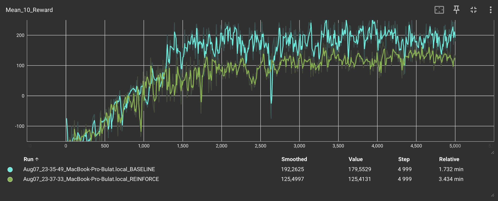

# PyTorch Implementation of Policy Gradient Methods (REINFORCE & Baseline)

<p align="center">
  
</p>

---

### Table of Contents
* [Algorithms Overview](#algorithms-overview)
* [Implementation Details](#implementation-details)
* [Key Features](#key-features)
* [Installation](#installation)
* [Run](#run)
* [Usage Examples](#usage-examples)
* [Results & Comparisons](#results--comparisons)
* [Dependencies](#dependencies)
* [Contributing](#contributing)
* [License](#license)

---

### Algorithms Overview

#### 1. REINFORCE (Vanilla Policy Gradient)
The basic [Policy Gradient Method](https://en.wikipedia.org/wiki/Policy_gradient_method) implementation:
1. **Full episode play**
2. **Calculate discounted returns**:
   
3. **Normalize returns**
4. **Calculate loss**:
   \,R_t$)
5. **Update policy**

#### 2. REINFORCE with Baseline
Enhanced version with reduced variance:
- Uses reward baseline: `b = 𝔼[R]`
- Advantage function: `A(s,a) = R - b`
- **2x faster convergence** compared to vanilla REINFORCE
- More stable learning dynamics

---

### Implementation Details
Core components in the code:

1. **Network Architecture** (`Net` class):
```python
nn.Sequential(
    nn.Linear(observation_size, 128),
    nn.ReLU(),
    nn.Linear(128, action_size)
)
```

2. **Agent Workflow**:
```python
# 1. Collect episode
all_logits = self._play_episode()

# 2. Calculate rewards
gamma_rs = self._gamma_rewards(self.rewards)

# 3. Compute advantage (baseline only)
baseline = gamma_rs.mean()
advantage = gamma_rs - baseline

# 4. Update policy
loss = self._calc_loss(all_logits, advantage)
loss.backward()
```

3. **Key Improvements in Baseline**:
- Advantage normalization: `(advantage - mean)/std`
- Reduced gradient variance
- Faster convergence (see Results section)

---

### Key Features
- 🚀 **Clean PyTorch implementations**
- ⏱️ **Time monitoring** per episode and total training
- 📊 **TensorBoard logging** for all metrics
- 📈 **Performance comparison** between algorithms
- 🎮 **Gymnasium environment support**

---

### Installation
1. Clone the repository:  
```bash
git clone https://github.com/yourusername/policy-gradients.git
cd policy-gradients
```

2. Install requirements:
```bash
pip install torch gymnasium numpy
```

---

### Run

#### Evaluate trained policy:
```python
eval_env = gym.make("LunarLander-v3", render_mode="human")
eval_agent = Agent(net, eval_env)
score = eval_agent.play(render=True)
```

---

### Usage Examples

#### Training and Evaluation
```python
from reinforce import Net as ReinforceNet, Agent as ReinforceAgent
from baseline import Net as BaselineNet, Agent as BaselineAgent

# Vanilla REINFORCE
env = gym.make("LunarLander-v3")
net = ReinforceNet(env.observation_space.shape[0], env.action_space.n)
agent = ReinforceAgent(net, env)
agent.learn(5000)

# REINFORCE with Baseline
env = gym.make("LunarLander-v3")
net = BaselineNet(env.observation_space.shape[0], env.action_space.n)
agent = BaselineAgent(net, env)
agent.learn(2500)  # Half the episodes for same performance

# Evaluation
eval_env = gym.make("LunarLander-v3", render_mode="human")
eval_agent = Agent(net, eval_env)
score = eval_agent.play(render=True)
```

---

### Results & Comparisons


**Key Findings:**
- REINFORCE with Baseline achieves **2x faster convergence**
- Baseline reduces variance leading to **smoother learning curves**
- **Almost 2x higher rewards** thanks to the baseline

| Metric                  | REINFORCE | REINFORCE+Baseline |
|-------------------------|----------|-------------------|
| Episodes to 200+ reward | -        | 1600              |
| Training time           | 3.4 min  | 1.7 min           |

---

### Dependencies
- Python 3.8+
- [PyTorch](https://pytorch.org/)
- [Gymnasium](https://gymnasium.farama.org/)
- [NumPy](https://numpy.org/)

---

### Contributing
Contributions are welcome! Please follow these steps:
1. Fork the repository
2. Create your feature branch (`git checkout -b feature/improvement`)
3. Commit changes (`git commit -am 'Add new feature'`)
4. Push to branch (`git push origin feature/improvement`)
5. Open a Pull Request

---

### License
This project is licensed under the **MIT License** - see the [LICENSE](LICENSE) file for details.

---
> **Educational Focus**: Clear implementations for learning Policy Gradient methods, with practical comparison between vanilla and baseline-enhanced versions.
