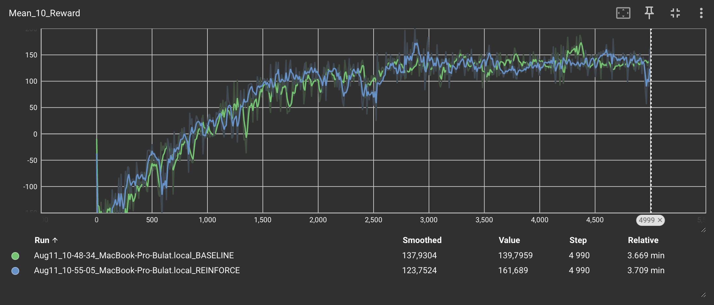
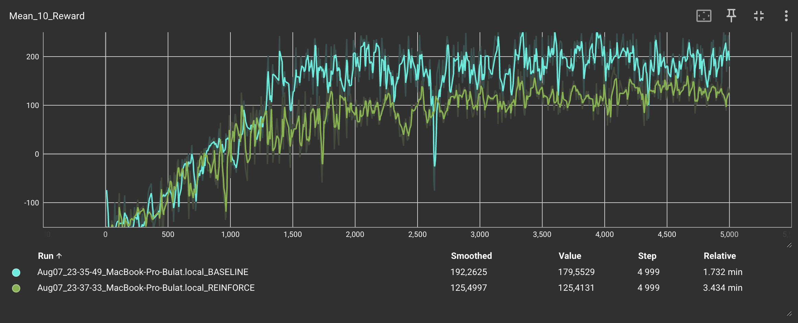
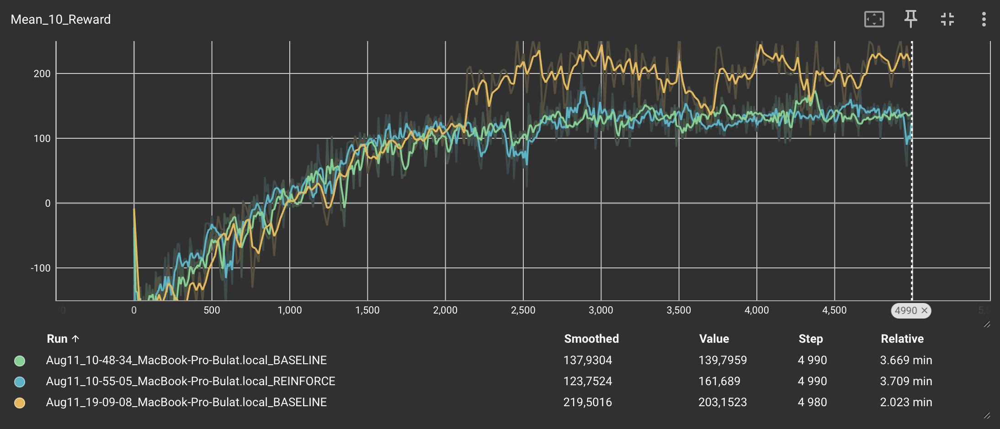

# PyTorch Implementation of Policy Gradient Methods

<p align="center">
  
</p>

Clean PyTorch implementations of PG algorithms with comparisons, gymnasium
envs support, logging, etc.


---

## Code is being completely refactored
<p align="center">
  
</p>

### Work in progress:
1. Implement reusable Agent, Buffer, and Net files/classes: ✅
2. Rewrite the shitcode and comment it ✅
3. Rewrite `algorithms/reinforce.py` ✅
4. Rewrite `algorithms/baseline.py` ✅
5. Implement `algorithms/a2c` ✅
6. Add A2C to README.md WIP
7. Implement PPO and SAC

---

## Table of Contents
- [Algorithms Overview](#algorithms-overview)
  - [1. REINFORCE (Vanilla Policy Gradient)](#1-reinforce-vanilla-policy-gradient)
  - [2. REINFORCE with Baseline](#2-reinforce-with-baseline)
- [Installation](#installation)
- [Run](#run)
  - [How to run](#how-to-run)
  - [Basic Training Process Overview](#basic-training-process-overview)
- [Comparison between Vanilla REINFORCE and REINFORCE with mean baseline](#comparison-between-vanilla-reinforce-and-reinforce-with-mean-baseline)
- [Contributing](#contributing)
- [License](#license)

---

## Algorithms Overview
### 1. REINFORCE (Vanilla Policy Gradient)
The basic [Policy Gradient Method](https://en.wikipedia.org/wiki/Policy_gradient_method) implementation:
1. **Full episode play**
2. **Calculate discounted returns**:
   
3. **Normalize returns**
4. **Calculate loss**:
   \,R_t$)
5. **Update policy**

### 2. REINFORCE with Baseline
Enhanced version with reduced variance:
- Uses reward baseline: `b = 𝔼[R]`
- Advantage function: `A(s,a) = R - b`
- More stable learning dynamics (kind of)

### Entropy bonus
Entropy is implemented as:

`entropy = -(probs * log_probs).sum(dim=1).mean()`

And subtracted from loss function with entropy coefficient:

`loss = pg_loss - entropy * entropy_coef`

---

## Installation
1. Clone the repository:  
```bash
git clone https://github.com/buuuuulat/pytorch_policy_gradients.git
cd pytorch_policy_gradients
```

2. Install requirements:
```bash
pip install torch gymnasium numpy
```

---

## Run
### How to run
All algorithms can be found in the `algorithms/` directory and are ready
to be used. You can adjust hyperparameters and choose any gymnasium compatible
environment.

#### Example Usage
```bash
python3 algorithms/reinforce.py
```

> Note: Continuous action space is not yet supported.

### Basic Training Process Overview
```pseudocode
while num_episodes < n:
    for step in episode:
        action = agent.choose_action(obs)
        exp = env.play_step(action)
        buffer.append(exp)
        buffer.calc_rewards()
        agent.update_grads()
```

---

## Comparison Between Methods
No much difference between **reinforce** and **reinforce with baseline** on **LunarLander-v3**



However, in some cases, baseline shows 2x boost in convergence
speed and highest reward



With **Entropy Bonus** added (yellow graph), the results are as follows:
- Much higher Mean Rewards
- Almost 2x speed boost on 5000 episodes



---

## Contributing
Contributions are welcome! Please follow these steps:
1. Fork the repository
2. Create your feature branch (`git checkout -b feature/improvement`)
3. Commit changes (`git commit -am 'Add new feature'`)
4. Push to branch (`git push origin feature/improvement`)
5. Open a Pull Request

---

### License
This project is licensed under the **MIT License** - see the [LICENSE](LICENSE) file for details.

---
> **Educational Focus**: Clear implementations for learning Policy Gradient methods, with practical comparison between
> different versions, so the speed and optimization were not the main goal.
>
> In order to optimize it, cuda support should be properly added and List usages in buffer should be avoided as well
> as the transitions between PyTorch Tensors and NumPy Arrays.