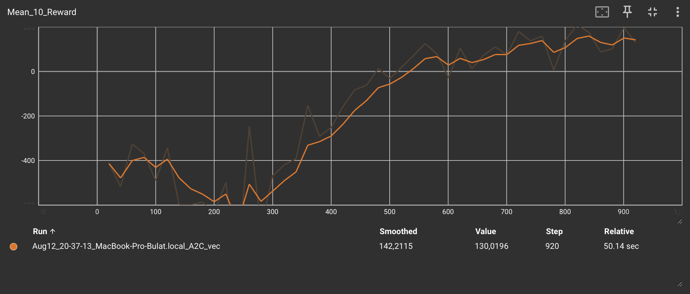

# PyTorch Implementation of Policy Gradient Methods

<p align="center">
  
</p>

Clean PyTorch implementations of PG algorithms with comparisons, Gymnasium
envs support, logging, etc.


---

## Code is being refactored
<p align="center">
  
</p>

### Work in progress:
1. Implement reusable Agent, Buffer, and Net files/classes ✅
2. Rewrite legacy code and add comments ✅
3. Rewrite `algorithms/reinforce.py` ✅
4. Rewrite `algorithms/baseline.py` ✅
5. Implement `algorithms/a2c` ✅
6. Add A2C to README.md ✅
7. Add vec env support for A2C
8. Implement PPO and SAC

---

## Table of Contents
- [Algorithms Overview](#algorithms-overview)
  - [1. REINFORCE (Vanilla Policy Gradient)](#1-reinforce-vanilla-policy-gradient)
  - [2. REINFORCE with Baseline](#2-reinforce-with-baseline)
  - [3. A2C](#3-a2c)
  - [Entropy Bonus](#entropy-bonus)
- [Installation](#installation)
- [Run](#run)
  - [How to run](#how-to-run)
  - [Basic Training Process Overview](#basic-training-process-overview)
- [Comparison Between Methods](#comparison-between-methods)
- [Contributing](#contributing)
- [License](#license)

---

## Algorithms Overview

### 1. REINFORCE (Vanilla Policy Gradient)
The basic [Policy Gradient Method](https://en.wikipedia.org/wiki/Policy_gradient_method) implementation:
1. **Full episode play**
2. **Calculate discounted returns**:
   
3. **Normalize returns**
4. **Calculate loss**:
   \,R_t$)
5. **Update policy**

### 2. REINFORCE with Baseline
Enhanced version with reduced variance:
- Uses reward baseline: `b = 𝔼[R]`
- Advantage function: `A(s,a) = R - b`
- More stable learning dynamics (kind of)

### 3. A2C
`algorithms/a2c.py`

**Status:** works, but single-env setup does **not** reliably converge.  
**Multi-env (vectorized) support** is required for proper A2C performance.

> Multi-env support is coming. See the [drafts branch](https://github.com/buuuuulat/pytorch_policy_gradients/tree/drafts).

**Core idea:** actor–critic with a shared backbone (`A2CNet`) and two heads:
- **Actor:** categorical policy over discrete actions
- **Critic:** state-value estimate `V(s)`

**Training signal:**
- Advantages: `A_t = R_t − V_t`
- Policy loss: `L_π = − E[ log π(a_t|s_t) * A_t ]`
- Value loss: `L_V = MSE(V_t, R_t)`
- Entropy bonus: see [Entropy Bonus](#entropy-bonus)

**Bootstrapping & unrolls:**
- Returns are bootstrapped with the critic’s value at episode boundary (or `0` on terminal).
- Optional unrolling via `UNROLL_STEPS > 0` allows updates inside long episodes.

**Implementation bits:**
- Agent: `A2CAgent` (policy/value losses, entropy, grad-clip)
- Buffer: `A2CBuffer` (stores values; discounted returns with bootstrap)
- Model: `A2CNet` (shared MLP → actor & critic heads)

**Results (LunarLander-v3):**  
See **A2C** curve here →   
With **8 vectorized envs** A2C shows markedly better results vs. REINFORCE/baseline.

### Entropy Bonus
Entropy is implemented as:

`entropy = -(probs * log_probs).sum(dim=1).mean()`

And subtracted from loss function with entropy coefficient:

`loss = policy_loss + value_coef * value_loss - entropy * entropy_coef`

---

## Installation
1. Clone the repository:  
```bash
git clone https://github.com/buuuuulat/pytorch_policy_gradients.git
cd pytorch_policy_gradients
````

2. Install requirements:

```bash
pip install torch gymnasium numpy
```

---

## Run

### How to run

All algorithms can be found in the `algorithms/` directory and are ready
to be used. You can adjust hyperparameters and choose any Gymnasium-compatible
environment.

#### Example Usage

```bash
# REINFORCE
python3 algorithms/reinforce.py

# A2C
python3 algorithms/a2c.py
```

> Note: Continuous action space is not yet supported.

### Basic Training Process Overview

```pseudocode
while num_episodes < n:
    for step in episode:
        action = agent.choose_action(obs)
        exp = env.play_step(action)
        buffer.append(exp)
        buffer.calc_rewards()
        agent.update_grads()
```

---

## Comparison Between Methods

Not much difference between **REINFORCE** and **REINFORCE with baseline** on **LunarLander-v3**:


However, in some cases, baseline shows \~2× boost in convergence
speed and the highest reward:


With **Entropy Bonus** added (yellow graph), the results are as follows:

* Much higher mean rewards
* Almost 2× speed boost over 5000 episodes


---

## Contributing

Contributions are welcome! Please follow these steps:

1. Fork the repository
2. Create your feature branch (`git checkout -b feature/improvement`)
3. Commit changes (`git commit -am 'Add new feature'`)
4. Push to branch (`git push origin feature/improvement`)
5. Open a Pull Request

---

### License

This project is licensed under the **MIT License** — see the [LICENSE](LICENSE) file for details.

---

> **Educational Focus**: Clear implementations for learning Policy Gradient methods, with practical comparison between
> versions, so speed and heavy optimizations were not the main goal.
>
> To optimize further, add proper CUDA support and avoid Python lists in buffers as well as frequent Tensor↔NumPy transfers.
